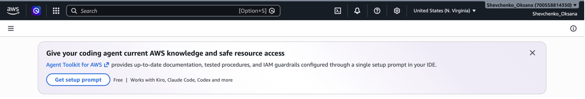
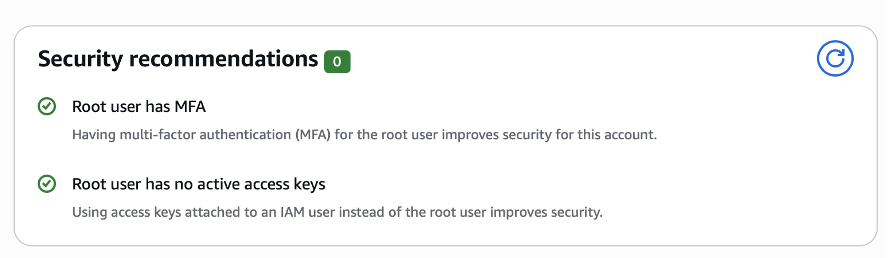
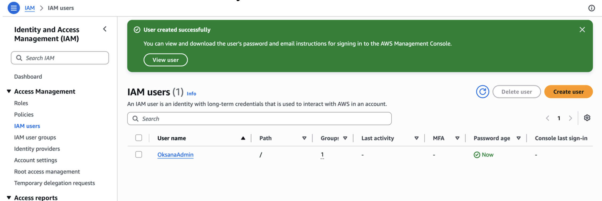
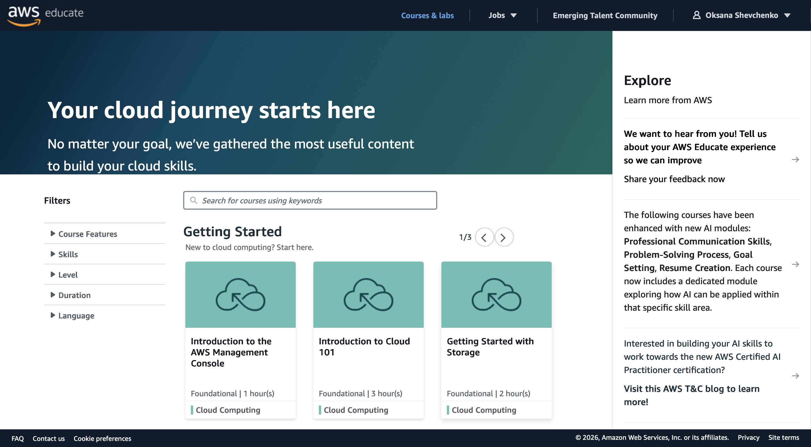
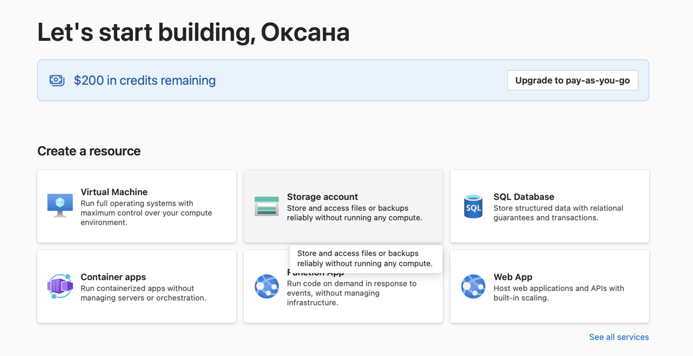

# Lab #1

## Register with Cloud Providers: AWS, AWS Educate, Microsoft Azure

### Objective

The objective of this lab work is to register with cloud providers and prepare accounts for future practical works.

---

## Task 1. AWS Free Tier Account

An AWS account was successfully created and configured.

### Multi-Factor Authentication

Multi-factor authentication (MFA) was enabled for the AWS root user in order to improve account security.

### IAM Administrator User

An IAM administrator user named `OksanaAdmin` was created.

The user was added to the `Administrators` group with administrative permissions.

---

## Task 2. AWS Educate

An AWS Educate account was successfully created using the university email address.

The account provides access to AWS educational courses and labs.

---

## Task 3. Microsoft Azure

A Microsoft Azure account was successfully activated.

The Azure portal provides access to cloud services such as Virtual Machines, Storage Accounts, SQL Databases, Container Apps, Function Apps, and Web Apps.

---

## Task 4. GitHub

A GitHub account and repository were used to store the laboratory work report.

GitHub account:  
https://github.com/OksanaShevchenko

Repository:  
https://github.com/OksanaShevchenko/Labs

---

## Conclusion

During this lab work, accounts for AWS, AWS Educate, Microsoft Azure, and GitHub were prepared for future works.

Multi-factor authentication was enabled for the AWS root account, and a separate IAM administrator user was created to improve account security.

The AWS Educate and Microsoft Azure platforms were successfully accessed, and the report was uploaded to GitHub.
